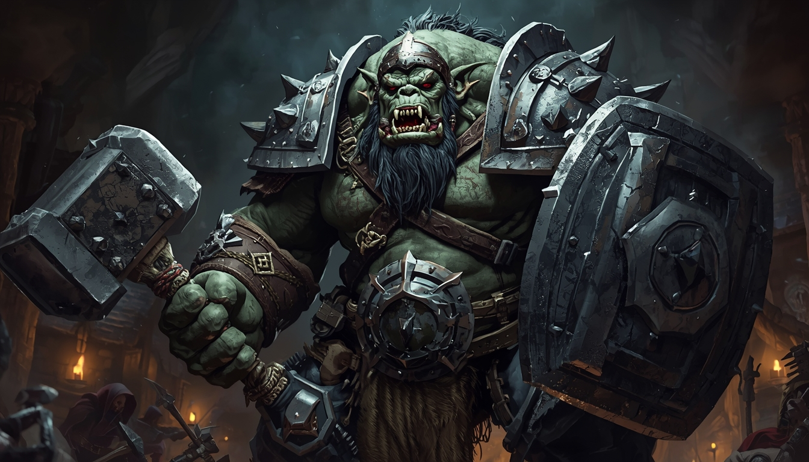

# CHARACTER 1: GROND  Troll Fighter, Level 3

*"The Wall"  Heavy Infantry*

---

## RACE & PROFESSION

| | |
|---|---|
| **Race** | Troll (Big, Size VI) |
| **Profession** | Fighter |
| **Level** | 3 (30,000 XP) |
| **Culture** | Harsh |
| **Height** | 9' |
| **Weight** | ~800 lbs |

---

## STATS

| Stat | Temp | Pot | Bonus | Racial | **Net** |
|------|------|-----|-------|--------|---------|
| Agility (Ag) | 91 | 94 | +8 | -1 | **+7** |
| Constitution (Co) | 86 | 93 | +6 | +2 | **+8** |
| Empathy (Em) | 24 | 40 | -4 | -5 | **-9** |
| Intuition (In) | 56 | 79 | +1 | +0 | **+1** |
| Memory (Me) | 43 | 52 | -1 | -3 | **-4** |
| Presence (Pr) | 78 | 89 | +5 | +0 | **+5** |
| Quickness (Qu) | 72 | 75 | +4 | +0 | **+4** |
| Reasoning (Re) | 68 | 86 | +3 | -3 | **+0** |
| Self Discipline (SD) | 53 | 87 | +0 | -3 | **-3** |
| Strength (St) | 90 | 100 | +8 | +5 | **+13** |

---

## COMBAT QUICK REFERENCE

| | Value |
|---|---|
| **Hits** | **153** |
| **Death Threshold** | -68 hits |
| **OB (Warhammer)** | **+80** (before parry allocation) |
| **Shield DB** | +36 (Wall Shield +30, Passive Block +6) |
| **Quickness DB** | +12 |
| **Initiative** | 2d10 + **4** |
| **BMR** | **28'/round** |
| **Endurance** | **+77** |

### Typical Combat Postures

| Posture | OB | DB | Notes |
|---------|----|----|-------|
| **Balanced** (Parry 40) | +40 | +88 | Qu 12 + Shield 36 + Parry 40 |
| **Aggressive** (Parry 20) | +60 | +68 | Qu 12 + Shield 36 + Parry 20 |
| **Full Offense** (No Parry) | +80 | +48 | Qu 12 + Shield 36 |
| **Riposte / Full Turtle** (Parry All) | +0 | +128 | If no hits delivered: free attack at OB = 50 - foe's roll |

### Attack Details

| Weapon | Table | Size | Criticals | Fumble | Length |
|--------|-------|------|-----------|--------|--------|
| Warhammer (Big) | War Hammer | **Big (+1)** | Krush (K) | 4 (eff. 3) | ~3' |

- Big attack = +1 critical severity vs Medium targets
- OB Stats (St+St+Ag): 13+13+7 = +33

---

## DEFENSE & ARMOR

### Full Kit

| Location | AT | Source |
|----------|-----|--------|
| Body | **7** | Metal Scale, Armor II enchanted |
| Head | **9** | Heavy Metal Helm |
| Arms/Legs | **4** | Natural Hide |

| Penalty | Base | Armor II | MiA (+36) | **Net** |
|---------|------|----------|-----------|--------|
| Maneuver | -70 | +10 | +36 | **-24** |
| Ranged | -30 |  |  | **-30** |
| Perception | -15 |  |  | **-15** |

### Light Kit: Natural AT 4 everywhere, no penalties.

### Wall Shield: +30 DB, defends vs 4 attacks, Passive Block +6 (Shield ranks)

---

## RESISTANCE ROLLS

| Type | Stat | Racial | Level | **Total** |
|------|------|--------|-------|-----------|
| Physical | +8 | +15 | +6 | **+29** |
| Fear | -3 |  | +6 | **+3** |
| Channeling | +1 | -10 | +6 | **-3** |
| Essence | -9 | -10 | +6 | **-13** |
| Mentalism | +5 | -10 | +6 | **+1** |

*Elemental Resistance III (Cold & Heat): +15 DB/RR/Endurance vs cold, ice, heat, fire; crits -1 severity*

---

## SKILLS

### Combat Skills

| Skill | Ranks | Rank Bonus | Prof | Knack | Stats | **Total** |
|-------|-------|-----------|------|-------|-------|-----------|
| Hafted (Warhammer) | 7 | +35 | +7 | +5 | +33 | **+80** |
| Shield | 6 | +30 | +6 | +5 | +33 | **+74** |
| Wrestling | 7 | +35 |  |  | +33 | **+68** |

### Defense & Body

| Skill | Ranks | Rank Bonus | Prof | Stats | **Total** |
|-------|-------|-----------|------|-------|-----------|
| Body Development | 9 | +45 | +9 | +13 | **+67** |
| Maneuvering in Armor | 6 | +30 | +6 |  | **+36** |
| Fortitude | 6 | +30 | +6 | +2 | **+38** |
| Weight-training | 6 | +30 | +6 | +18 | **+54** |
| Running | 8 | +40 | +8 | +28 | **+76** |

### Battle & Combat Expertise

| Skill | Ranks | Rank Bonus | Prof | **Total** |
|-------|-------|-----------|------|-----------|
| Protect | 6 | +30 | +6 | **+36** |
| Restricted Quarters | 6 | +30 |  | **+30** |
| Footwork | 3 | +15 |  | **+15** |
| Reverse Strike | 3 | +15 |  | **+15** |

### Awareness & Outdoor

| Skill | Ranks | Rank Bonus | Stats | **Total** |
|-------|-------|-----------|-------|-----------|
| Perception | 8 | +40 | -2 | **+38** |
| Survival | 6 | +30 | -3 | **+27** |

### Background (Culture Only)

| Skill | Ranks | Notes |
|-------|-------|-------|
| Metalcraft (Blacksmith) | 2 | |
| Region Lore (Own) | 5 | |
| Leathercraft | 1 | |
| Hunter (Vocation) | 1 | |
| Trollish (spoken) | 4 | Fluent |
| Common (spoken) | 4 | Functional |

---

## TALENTS

### Purchased

| Talent | Cost | Effect |
|--------|------|--------|
| **Tough II** | 6 DP | +10 base hits (+15 after Big 1.5) |
| **Riposte** | 20 DP | All OB to parry + fully negate attack = free attack at OB 50 - foe's roll |
| **Light Sensitivity Reduction** | 10 DP | Reduces Light Sensitivity from Tier II to Tier I |

### Racial

| Talent | Effect |
|--------|--------|
| Darkvision I | See 10' in complete darkness |
| Nightvision | Dim light as daylight; darkness penalties -40 |
| Increased Size I | Big (Size VI); hits 1.5 |
| Natural Armor III | AT 4, no encumbrance or maneuver penalties |
| Natural Weaponry | Claw attacks |
| Elemental Resistance III (Cold) | +15 DB/RR/End vs cold/ice; Cold crits -1 severity |
| Elemental Resistance III (Heat) | +15 DB/RR/End vs heat/fire; Heat crits -1 severity |

### Racial Flaws

| Flaw | Effect |
|------|--------|
| Light Sensitivity I | -25 bright sun, -0 cloudy, -0 shade |
| Inept (Influence) V | -25 to all Influence skills |

---

## SIZE EFFECTS

- Warhammer attacks are Big size (+1 crit severity vs Medium or smaller)
- Medium foes get +5 DB against your attacks
- Incoming Medium attacks: criticals reduced by 1 severity
- Melee range = 4.5' + weapon length (larger engagement zone)
- Charging at Jog+: additional +1 size on top of Big

---

## EQUIPMENT

| Item | Notes |
|------|-------|
| Metal Scale Armor, Armor II (Big) | AT 7, enchanted -10 maneuver penalty |
| Heavy Metal Helm (Big) | Head AT 9 |
| Warhammer (Big) | ~56 lbs, Str 65, Fumble 4 (eff. 3) |
| Wall Shield (Big) | ~80 lbs, +30 DB, defends vs 4 attacks |
| Belt pouch, rope, rations | Misc gear |

---
---