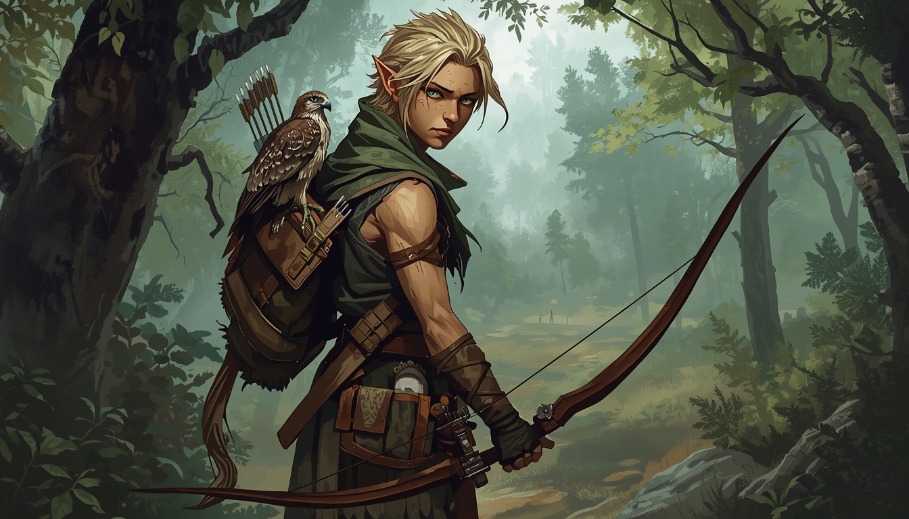

# CHARACTER 3: RALHANN  Wood Elf Ranger, Level 3

*"The Warden"  Ranged Fire Support, Scout & Party Buffer*

---

## RACE & PROFESSION

| | |
|---|---|
| **Race** | Wood Elf (Medium, Size V) |
| **Profession** | Ranger (Channeling Semi-Spellcaster) |
| **Level** | 3 (30,000 XP) |
| **Culture** | Sylvan |
| **Height** | 6' |
| **Weight** | ~150 lbs |

---

## STATS

| Stat | Temp | Pot | Bonus | Racial | **Net** |
|------|------|-----|-------|--------|---------|
| Agility (Ag) | 90 | 100 | +8 | +2 | **+10** |
| Constitution (Co) | 81 | 99 | +5 | +0 | **+5** |
| Empathy (Em) | 63 | 85 | +2 | +2 | **+4** |
| Intuition (In) | 85 | 100 | +6 | +0 | **+6** |
| Memory (Me) | 52 | 90 | +0 | +1 | **+1** |
| Presence (Pr) | 69 | 75 | +3 | +2 | **+5** |
| Quickness (Qu) | 91 | 97 | +8 | +3 | **+11** |
| Reasoning (Re) | 64 | 68 | +2 | +0 | **+2** |
| Self Discipline (SD) | 77 | 81 | +4 | -5 | **-1** |
| Strength (St) | 82 | 95 | +5 | +2 | **+7** |

---

## COMBAT QUICK REFERENCE

| | Value |
|---|---|
| **Hits** | **64** |
| **Death Threshold** | -45 hits |
| **OB (Composite Bow)** | **+74** (before parry allocation) |
| **OB (Backup Sword)** | **+34** |
| **Quickness DB** | +33 |
| **Passive Dodge** | +8 (Running ranks) |
| **Initiative** | 2d10 + **11** |
| **BMR** | **26'/round** |
| **Endurance** | **+54** |
| **Power Points** | **47** |

### Typical Combat Postures

| Posture | OB | DB | Notes |
|---------|----|----|-------|
| **Ranged (Bow)** | +74 | +41 | Qu 33 + Dodge 8. Bow is 2H, no parry while shooting |
| **Melee Defensive** (Parry 20) | +14 | +61 | Qu 33 + Dodge 8 + Parry 20. Emergency only |
| **Full Ranged + Aimed** | +74 to +94 | +41 | Sharpshooter not taken; this is base ranged |

### Attack Details

| Weapon | Table | Size | Criticals | Fumble | Range |
|--------|-------|------|-----------|--------|-------|
| Composite Bow | Bow, Composite | Medium (+0) | Puncture | 3 | S 100' / M 200' / L 300' / E 400' / A 500' |
| Arming Sword | Arming Sword | Medium (+0) | Slash, Krush, Puncture | 4 | 3.5' |

- Bow OB Stats (Ag+St+Ag): 10+7+10 = +27
- Blade OB Stats (Ag+St+St): 10+7+7 = +24

---

## DEFENSE & ARMOR

| Location | AT | Source |
|----------|-----|--------|
| All | **1** | Clothing |

No armor penalties. Full mobility for Stalking, Climbing, Perception.

**Defense Stack:** Qu DB 33 + Passive Dodge 8 = **+41 base DB.** Stay at range and don't get hit.

---

## RESISTANCE ROLLS

| Type | Stat | Racial | Level | Realm | **Total** |
|------|------|--------|-------|-------|-----------|
| Physical | +5 | +10 | +6 |  | **+21** |
| Fear | -1 |  | +6 |  | **+5** |
| Channeling | +6 | -5 | +6 | +10 | **+17** |
| Essence | +4 | -5 | +6 |  | **+5** |
| Mentalism | +5 | -5 | +6 |  | **+6** |

---

## SKILLS

### Combat Skills

| Skill | Ranks | Rank Bonus | Prof | Knack | Stats | **Total** |
|-------|-------|-----------|------|-------|-------|-----------|
| Bow (Composite) | 7 | +35 | +7 | +5 | +27 | **+74** |
| Blade (Arming Sword) | 2 | +10 |  |  | +24 | **+34** |
| Strikes (Unarmed) | 1 | +5 |  |  | +24 | **+29** |

### Awareness & Outdoor

| Skill | Ranks | Rank Bonus | Prof | Knack | Stats | **Total** |
|-------|-------|-----------|------|-------|-------|-----------|
| Perception | 7 | +35 | +7 | +5 | +7 | **+54** (+64 locating sounds) |
| Tracking | 7 | +35 | +7 |  | +7 | **+49** |
| Survival | 8 | +40 | +8 |  | +9 | **+57** |
| Navigation | 2 | +10 | +2 |  | +9 | **+21** |

### Movement

| Skill | Ranks | Rank Bonus | Prof | Stats | **Total** |
|-------|-------|-----------|------|-------|-----------|
| Running | 8 | +40 | +8 | +22 | **+70** |
| Climbing | 5 | +25 | +5 | +22 | **+52** |
| Swimming | 3 | +15 |  | +22 | **+37** |

### Subterfuge

| Skill | Ranks | Rank Bonus | Prof | Stats | **Total** |
|-------|-------|-----------|------|-------|-----------|
| Stalking | 8 | +40 | +8 | +15 | **+63** |
| Concealment | 4 | +20 | +4 | +15 | **+39** |

### Body & Defense

| Skill | Ranks | Rank Bonus | Stats | **Total** |
|-------|-------|-----------|-------|-----------|
| Body Development | 7 | +35 | +9 | **+44** |

### Animal

| Skill | Ranks | Rank Bonus | Prof | Stats | **Total** |
|-------|-------|-----------|------|-------|-----------|
| Animal Handling (Hawks) | 5 | +25 | +5 | +19 | **+49** |

### Spell Lists (Channeling)

| List | Ranks | Spells Available (to Level) | Rank Bonus | Stats | **Total** |
|------|-------|---------------------------|-----------|-------|-----------|
| Beastly Ways | 6 | Cat Eyes (1), Grasshopper's Legs (2), Wolf Senses (3), Rabbit Reflexes (4), Bat Sense (5), Otterlungs (6) | +30 | +13 | **+43** |

### Power Manipulation

| Skill | Ranks | Rank Bonus | Stats | **Total** |
|-------|-------|-----------|-------|-----------|
| Power Development | 6 | +30 | +17 | **+47** |

### Background (Culture Only)

| Skill | Ranks | Notes |
|-------|-------|-------|
| Herbalism | 1 | |
| Social Awareness | 1 | |
| Woodcraft (Crafting) | 1 | |
| Leathercraft (Crafting) | 1 | |
| Hunter (Vocation) | 1 | |
| Scout (Vocation) | 1 | |
| Region Lore (Own) | 5 | |
| Creature Lore (Forest) | 2 | |
| Creature Lore (Avian) | 2 | |
| Elven (spoken) | 4 | Fluent |
| Elven (written) | 2 | Literate |
| Common (spoken) | 3 | Functional |
| Common (written) | 2 | Literate |
| Sylvan/Druidic (spoken) | 2 | Nature tongue |

---

## TALENTS

### Purchased: None (all DP invested in skills and spells)

### Racial (All Elves)

| Talent | Effect |
|--------|--------|
| Nightvision | Dim light as daylight; darkness penalties -40 |
| Efficient Sleeper II | 2 hours meditation replaces 4 hours sleep |
| Immune to Disease I | Immune to all non-magical disease |

### Racial (Wood Elf Only)

| Talent | Effect |
|--------|--------|
| Cat Hearing | +10 to Perception maneuvers to locate sounds |

---

## KEY SPELLS

### Beastly Ways (Self Buffs)

| Level | Spell | Duration | Effect |
|-------|-------|----------|--------|
| 1 | Cat Eyes | 10 min/lvl | See in near darkness (no color) |
| 2 | Grasshopper's Legs | 1 min/lvl | +40 to jumping maneuvers |
| 3 | Wolf Senses | 10 min/lvl | +50 Perception (smell/hearing only) or +20 combined |
| 4 | Rabbit Reflexes | 1 min/lvl | +5 initiative |
| 5 | Bat Sense | 10 min/lvl | +50 to maneuvers when blinded |
| 6 | Otterlungs | 1 min/lvl | Hold breath for duration |

---

## TACTICAL NOTES

- **Wolf Senses + Cat Hearing + Perception +54:** Combined, this Ranger has effectively +74 Perception for hearing-based checks and +104 for smell/hearing only checks. Nothing sneaks up on this party.
- **Rabbit Reflexes:** +5 initiative on top of already +11 base = +16 initiative. Fastest combatant on most battlefields.
- **47 PP Pool:** Wolf Senses costs 3 PP, Rabbit Reflexes costs 4 PP, Cat Eyes costs 1 PP. Plenty of budget for a full day of buffing.
- **Initiative +11:** Goes before Ambrosia (+9) most rounds. Use first actions to cast buffs, then rain arrows.
- **Stalking +63:** Best stealth in the party by far. This is the advance scout.
- **Stay at range:** 64 hits and AT 1 means one good hit could be devastating. The bow's effective range keeps this character out of melee.

---

## EQUIPMENT

| Item | Notes |
|------|-------|
| Composite Bow | 2H, range S 100'/M 200'/L 300'/E 400'/A 500' |
| Arrows (40) | In quiver |
| Arming Sword | Backup melee, 3.5' length |
| Clothing (AT 1) | No armor penalties |
| Quiver | Holds 20 arrows (carries 2) |
| Backpack, rope, rations | Misc gear |
| Hawk (trained) | Scouting companion |

---
---